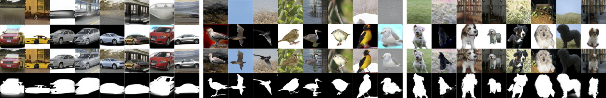
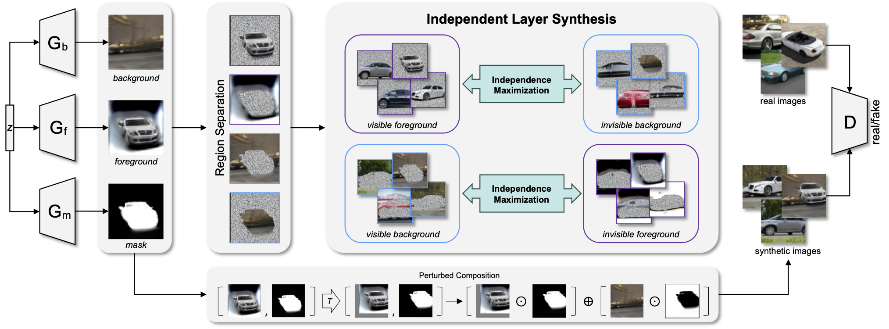

## ILSGAN: Independent Layer Synthesis for  Unsupervised Foreground-Background Segmentation

<p align="center">
  
  
</p>


本项目为 ILSGAN 论文的 PyTorch 实现。ILSGAN 能够针对单类单物的真实图片，实现强大的无监督前背景分割 SOTA 结果。
[[arXiv_paper]](https://arxiv.org/abs/2211.13974) [AAAI 2023] [Oral]

[[En](README.md)]

### 安装环境
ILSGAN 的安装环境配置基于 [StyleGAN2-ADA](https://github.com/NVlabs/stylegan2-ada-pytorch): PyTorch 1.7.1, Python 3.7, CUDA 11.0.
通常还需要安装如下的 python 库: `pip install click requests tqdm pyspng ninja imageio-ffmpeg==0.4.3`

### Dataset
我们使用 [DRC](https://github.com/yuPeiyu98/Deep-Region-Competition) 处理的 `CUB`, `Dog`, and `Car` 数据集训练 ILSGAN.
请根据 DRC 项目来得到对应的数据集。
* 与 DRC 不同，我们使用未经大小比例变换的原始图片来训练 ILSGAN。
因此针对 Dogs 数据集，同时需要从 DRC 项目中下载 `dogs_raw_data.zip`，解压之后将里面的文件放入 Dogs 数据集路径中。

最终应该得到如下所示的数据集目录结构：
```
DRC_processed
├── birds
│   ├── bounding_boxes.txt
│   ├── images
│   ├── images.txt
│   ├── segmentations
│   └── train_val_test_split.txt
├── cars
│   ├── data_mrcnn
│   ├── data_mrcnn_test_select.npy
│   └── data_mrcnn_train_select.npy
└── dogs
    ├── data_mrcnn
    ├── data_te_sel.npy
    ├── data_tr_sel.npy
    ├── test_orig
    └── train_orig
```
注意，请同时将 `train_ILS_64/128.py` 文件中有关数据集路径的配置修改为本地的路径。


### Getting started

对于 64*64 分辨率，可以直接运行如下命令。这将会自动地完成 ILSGAN 的训练、数据生成、无监督分割评估、以及互信息评估。
更改 --data 选项来选择 [car, cub, dog] 数据集。

```.bash
CUDA_VISIBLE_DEVICES=0 python train_ILS_64.py --outdir=./outputs --data=car --gpus=1 --cfg=ILS_predL --batch=32
```

对于 128*128 分辨率，需要手动运行如下命令以完成训练、生成、与评估。

```.bash
# 训练 ILSGAN
CUDA_VISIBLE_DEVICES=0 python train_ILS_128.py --outdir=./outputs --data=car --gpus=1 --cfg=ILS --batch=32

# 用 ILSGAN 生成分割样本
CUDA_VISIBLE_DEVICES=0 python generate_segmentation_samples.py --network=./outputs/The-Exp-For-Eval --n=50000 --topk=8000

# 评估分割
CUDA_VISIBLE_DEVICES=0 python eval_segmentation_eval128.py --aug=color --syn-data=./outputs/The-Exp-For-Eval/synthetic_data-XXXXXX --real-data=car --scale=128

# 评估互信息
CUDA_VISIBLE_DEVICES=0 python eval_MI_MINE.py --path=./outputs/The-Exp-For-Eval/auto_test/synthetic_data-XXXXXX

```

如果需要在 64*64 分辨率手动生成样本与评估结果，运行如下指令：
```.bash
# 用 ILSGAN 生成分割样本
CUDA_VISIBLE_DEVICES=0 python generate_segmentation_samples.py --network=./outputs/The-Exp-For-Eval --n=50000 --topk=8000

# 评估分割
CUDA_VISIBLE_DEVICES=0 python eval_segmentation.py --aug=color --syn-data=./outputs/The-Exp-For-Eval/synthetic_data-XXXXXX --real-data=car --scale=64

# 评估互信息
CUDA_VISIBLE_DEVICES=0 python eval_MI_MINE.py --path=./outputs/The-Exp-For-Eval/auto_test/synthetic_data-XXXXXX
```

### Citation
```
@inproceedings{Zou2023ilsgan,
  title={ILSGAN: Independent Layer Synthesis for Unsupervised Foreground-Background Segmentation},
  author={Zou, Qiran and Yang, Yu and Cheung, Wing Yin and Liu, Chang and Ji, Xiangyang},
  booktitle={Proceedings of the AAAI Conference on Artificial Intelligence (AAAI)},
  year={2023}
}
```


